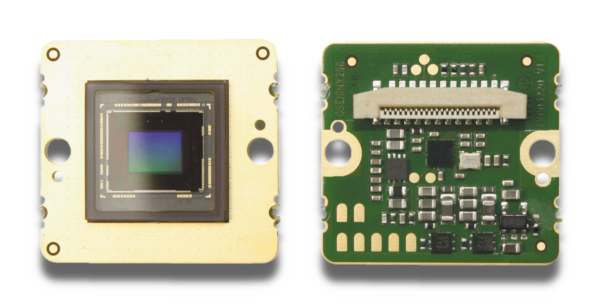

# Vision Components MIPI CSI-2 driver for NXP SoMs

## Version 0.4.0 ([History](VERSION.md))

* Supported system on modules
  * [Toradex Verdin iMX8M Plus](https://developer.toradex.com/hardware/verdin-som-family/modules/verdin-imx8m-plus)
  * [Toradex Verdin iMX8M Mini](https://developer.toradex.com/hardware/verdin-som-family/modules/verdin-imx8m-mini)
  * [Variscite DART-MX8M-PLUS](https://www.variscite.com/product/system-on-module-som/cortex-a53-krait/dart-mx8m-plus-nxp-i-mx-8m-plus)

* Supported carrier boards
  * [Toradex Dahlia Carrier Board](https://developer.toradex.com/hardware/verdin-som-family/carrier-boards/dahlia-carrier-board)
  * [Variscite DART-MX8M-PLUS Evaluation Kits](https://www.variscite.com/product/evaluation-kits/dart-mx8m-plus-evaluation-kits/)
  
* Supported board support packages
  * [Variscite Yocto Project](doc/variscite_yocto_project.md)
  * [Toradex Yocto Project](doc/toradex_yocto_project.md)
      
* Tested [VC MIPI Camera Modules](https://www.vision-components.com/fileadmin/external/documentation/hardware/VC_MIPI_Camera_Module/index.html)
  * IMX178, IMX183, IMX226
  * IMX250, IMX252, IMX264, IMX265, IMX273, IMX392
  * IMX290, IMX327, IMX462
  * IMX296, IMX297
  * IMX335
  * IMX412
  * IMX415
  * IMX565, IMX566, IMX567, IMX568
  * IMX900
  * OV9281

  ## Build

  Follow the instructions in the yocto project descriptions above.

  ## Test

  For a first test follow the instructions in [Using the test.sh Script](doc/using_test.sh_script.md)